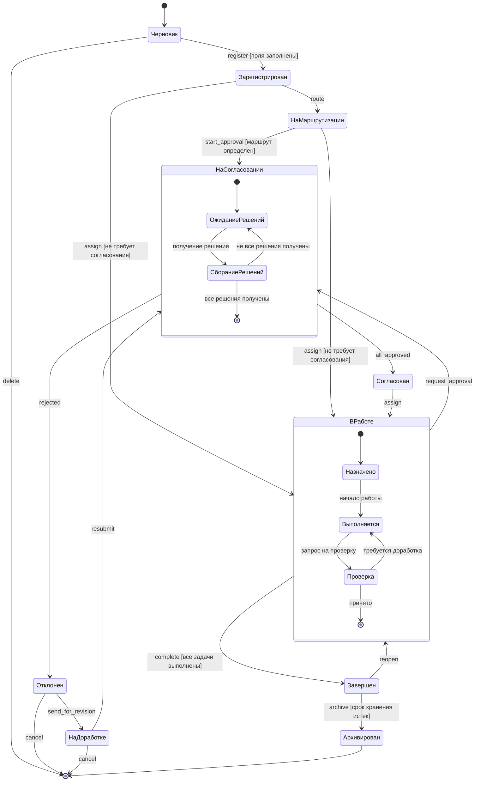

# Управление моделированием (UML State Diagrams)

## Диаграмма состояний документа

### Состояния документа

#### 1. Черновик (Draft)
**Начальное состояние нового документа**

- Документ создан, но не зарегистрирован официально
- Возможные действия:
  - Редактирование содержимого
  - Добавление вложений
  - Удаление документа

#### 2. Зарегистрирован (Registered)
**Официальная регистрация**

- Документ получил регистрационный номер
- Внесен в реестр
- Изменение содержимого ограничено
- Готов к дальнейшей обработке

#### 3. На маршрутизации (In Routing)
**Определение исполнителей**

- Определение маршрута обработки
- Система или пользователь назначает исполнителей

#### 4. На согласовании (In Approval)
**Процесс согласования**

- Направлен согласующим лицам
- Ожидание решений от всех необходимых согласующих

#### 5. Согласован (Approved)
**Положительное согласование**

- Все согласующие одобрили документ
- Готов к исполнению или дальнейшей обработке

#### 6. Отклонен (Rejected)
**Отрицательное решение**

- Один или несколько согласующих отклонили документ
- Требуется доработка или отмена

#### 7. На доработке (Under Revision)
**Возврат на корректировку**

- Документ возвращен инициатору
- Внесение изменений на основании замечаний

#### 8. В работе (In Progress)
**Исполнение**

- Документ у исполнителя
- Выполнение действий по документу

#### 9. Завершен (Completed)
**Завершение работы**

- Работа по документу завершена
- Все поручения выполнены

#### 10. Архивирован (Archived)
**Долгосрочное хранение**

- Перемещен в архив
- Завершен жизненный цикл в активной системе

### Переходы между состояниями

#### Из состояния Черновик:

```
event: register
condition: все обязательные поля заполнены
→ Зарегистрирован

event: delete
→ [Конечное состояние]
```

#### Из состояния Зарегистрирован:

```
event: route
→ На маршрутизации

event: assign
condition: тип документа не требует согласования
→ В работе
```

#### Из состояния На маршрутизации:

```
event: start_approval
condition: маршрут согласования определен
→ На согласовании

event: assign
condition: согласование не требуется
→ В работе
```

#### Из состояния На согласовании:

```
event: all_approved
condition: все согласования завершены положительно
→ Согласован

event: rejected
condition: есть отрицательное решение
→ Отклонен
```

#### Из состояния Отклонен:

```
event: send_for_revision
→ На доработке

event: cancel
→ [Конечное состояние]
```

#### Из состояния На доработке:

```
event: resubmit
→ На согласовании

event: cancel
→ [Конечное состояние]
```

#### Из состояния Согласован:

```
event: assign
→ В работе
```

#### Из состояния В работе:

```
event: complete
condition: все задачи выполнены
→ Завершен

event: request_approval
→ На согласовании
```

#### Из состояния Завершен:

```
event: archive
condition: истек срок хранения в активном архиве
→ Архивирован

event: reopen
→ В работе
```

#### Из состояния Архивирован:

```
- Извлечение из архива возможно только с созданием копии
- Копия создается в состоянии "Зарегистрирован"
```

### Внутренние действия в состояниях (Actions)

#### Состояние: На согласовании

**Entry action (при входе):**
```
- Отправка уведомлений всем согласующим
- Установка таймеров для контроля сроков
```

**Do activity (в процессе):**
```
- Ожидание решений
- Мониторинг сроков согласования
- Отправка напоминаний при приближении дедлайнов
```

**Exit action (при выходе):**
```
- Фиксация результатов согласования
- Остановка таймеров
- Обновление истории документа
```

#### Состояние: В работе

**Entry action (при входе):**
```
- Создание задач для исполнителей
- Установка сроков выполнения
- Отправка уведомления исполнителю
```

**Do activity (в процессе):**
```
- Мониторинг прогресса выполнения
- Отправка напоминаний при приближении сроков
- Эскалация при просрочке
```

**Exit action (при выходе):**
```
- Проверка завершенности всех задач
- Фиксация результатов исполнения
- Обновление статистики
```

#### Состояние: Зарегистрирован

**Entry action (при входе):**
```
- Присвоение регистрационного номера
- Запись метаданных в БД
- Создание записи в журнале аудита
```

#### Состояние: Архивирован

**Entry action (при входе):**
```
- Перемещение файлов в архивное хранилище
- Сжатие данных
- Обновление индексов архива
```

### Условия переходов (Guards)

**Примеры условий:**

```
[все обязательные поля заполнены]
[пользователь имеет права на согласование]
[все согласования текущего этапа завершены]
[срок исполнения не истек]
[документ не просрочен]
[все задачи выполнены]
[истек срок хранения в активном архиве]
```

### События (Events)

**Типы событий:**

1. **Пользовательские действия:**
   - register (регистрация)
   - approve (согласование)
   - reject (отклонение)
   - assign (назначение исполнителя)
   - complete (завершение работы)

2. **Системные события:**
   - deadline_approaching (приближение срока)
   - deadline_expired (просрочка)
   - archive_timeout (время архивирования)

3. **Внешние события:**
   - notification_sent (уведомление отправлено)
   - file_uploaded (файл загружен)

### Диаграмма состояний в нотации Mermaid


cat > docs/rating-work-2/12-uml-state-diagrams.md << 'EOF'
# Управление моделированием (UML State Diagrams)

## Диаграмма состояний документа

### Состояния документа

#### 1. Черновик (Draft)
**Начальное состояние нового документа**

- Документ создан, но не зарегистрирован официально
- Возможные действия:
  - Редактирование содержимого
  - Добавление вложений
  - Удаление документа

#### 2. Зарегистрирован (Registered)
**Официальная регистрация**

- Документ получил регистрационный номер
- Внесен в реестр
- Изменение содержимого ограничено
- Готов к дальнейшей обработке

#### 3. На маршрутизации (In Routing)
**Определение исполнителей**

- Определение маршрута обработки
- Система или пользователь назначает исполнителей

#### 4. На согласовании (In Approval)
**Процесс согласования**

- Направлен согласующим лицам
- Ожидание решений от всех необходимых согласующих

#### 5. Согласован (Approved)
**Положительное согласование**

- Все согласующие одобрили документ
- Готов к исполнению или дальнейшей обработке

#### 6. Отклонен (Rejected)
**Отрицательное решение**

- Один или несколько согласующих отклонили документ
- Требуется доработка или отмена

#### 7. На доработке (Under Revision)
**Возврат на корректировку**

- Документ возвращен инициатору
- Внесение изменений на основании замечаний

#### 8. В работе (In Progress)
**Исполнение**

- Документ у исполнителя
- Выполнение действий по документу

#### 9. Завершен (Completed)
**Завершение работы**

- Работа по документу завершена
- Все поручения выполнены

#### 10. Архивирован (Archived)
**Долгосрочное хранение**

- Перемещен в архив
- Завершен жизненный цикл в активной системе

### Переходы между состояниями

#### Из состояния Черновик:

```
event: register
condition: все обязательные поля заполнены
→ Зарегистрирован

event: delete
→ [Конечное состояние]
```

#### Из состояния Зарегистрирован:

```
event: route
→ На маршрутизации

event: assign
condition: тип документа не требует согласования
→ В работе
```

#### Из состояния На маршрутизации:

```
event: start_approval
condition: маршрут согласования определен
→ На согласовании

event: assign
condition: согласование не требуется
→ В работе
```

#### Из состояния На согласовании:

```
event: all_approved
condition: все согласования завершены положительно
→ Согласован

event: rejected
condition: есть отрицательное решение
→ Отклонен
```

#### Из состояния Отклонен:

```
event: send_for_revision
→ На доработке

event: cancel
→ [Конечное состояние]
```

#### Из состояния На доработке:

```
event: resubmit
→ На согласовании

event: cancel
→ [Конечное состояние]
```

#### Из состояния Согласован:

```
event: assign
→ В работе
```

#### Из состояния В работе:

```
event: complete
condition: все задачи выполнены
→ Завершен

event: request_approval
→ На согласовании
```

#### Из состояния Завершен:

```
event: archive
condition: истек срок хранения в активном архиве
→ Архивирован

event: reopen
→ В работе
```

#### Из состояния Архивирован:

```
- Извлечение из архива возможно только с созданием копии
- Копия создается в состоянии "Зарегистрирован"
```

### Внутренние действия в состояниях (Actions)

#### Состояние: На согласовании

**Entry action (при входе):**
```
- Отправка уведомлений всем согласующим
- Установка таймеров для контроля сроков
```

**Do activity (в процессе):**
```
- Ожидание решений
- Мониторинг сроков согласования
- Отправка напоминаний при приближении дедлайнов
```

**Exit action (при выходе):**
```
- Фиксация результатов согласования
- Остановка таймеров
- Обновление истории документа
```

#### Состояние: В работе

**Entry action (при входе):**
```
- Создание задач для исполнителей
- Установка сроков выполнения
- Отправка уведомления исполнителю
```

**Do activity (в процессе):**
```
- Мониторинг прогресса выполнения
- Отправка напоминаний при приближении сроков
- Эскалация при просрочке
```

**Exit action (при выходе):**
```
- Проверка завершенности всех задач
- Фиксация результатов исполнения
- Обновление статистики
```

#### Состояние: Зарегистрирован

**Entry action (при входе):**
```
- Присвоение регистрационного номера
- Запись метаданных в БД
- Создание записи в журнале аудита
```

#### Состояние: Архивирован

**Entry action (при входе):**
```
- Перемещение файлов в архивное хранилище
- Сжатие данных
- Обновление индексов архива
```

### Условия переходов (Guards)

**Примеры условий:**

```
[все обязательные поля заполнены]
[пользователь имеет права на согласование]
[все согласования текущего этапа завершены]
[срок исполнения не истек]
[документ не просрочен]
[все задачи выполнены]
[истек срок хранения в активном архиве]
```

### События (Events)

**Типы событий:**

1. **Пользовательские действия:**
   - register (регистрация)
   - approve (согласование)
   - reject (отклонение)
   - assign (назначение исполнителя)
   - complete (завершение работы)

2. **Системные события:**
   - deadline_approaching (приближение срока)
   - deadline_expired (просрочка)
   - archive_timeout (время архивирования)

3. **Внешние события:**
   - notification_sent (уведомление отправлено)
   - file_uploaded (файл загружен)

### Диаграмма состояний в нотации Mermaid


### Применение диаграммы состояний


**Для валидации бизнес-логики:**
- Проверка допустимости переходов
- Предотвращение недопустимых операций
- Обеспечение согласованности состояния системы

**Для тестирования:**
- Покрытие всех возможных переходов
- Тестирование граничных условий
- Проверка условий переходов (guards)

## Преимущества использования диаграмм состояний

1. **Визуализация жизненного цикла** - наглядное представление всех состояний
2. **Выявление ошибок проектирования** - обнаружение недопустимых переходов
3. **Упрощение реализации** - четкая спецификация для разработчиков
4. **Облегчение тестирования** - ясное понимание возможных сценариев
5. **Документирование логики** - формализованное описание бизнес-процессов
